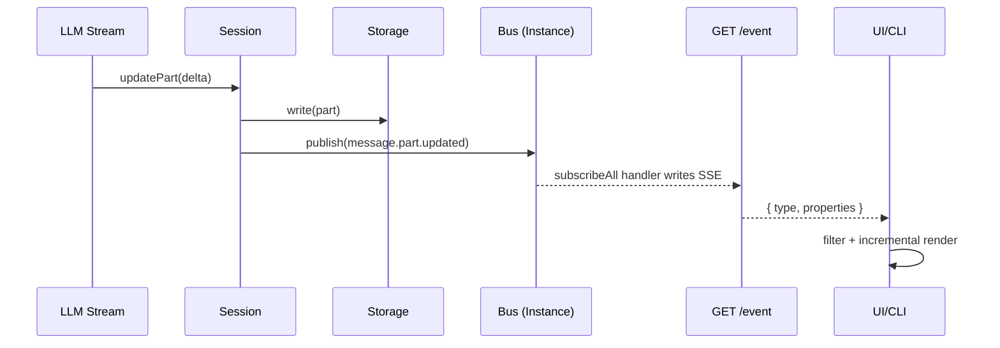
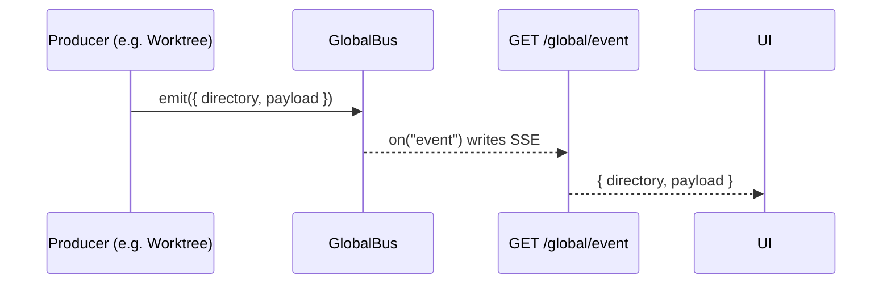

# 事件驱动架构（Event System）

事件系统不仅是“发布-订阅”，它还是 OpenCode 把 **LLM 流式输出、工具执行、权限/问答交互、文件/LSP 反馈** 串成可增量渲染系统的核心机制。

这篇文档聚焦三个问题：

1. 事件类型如何定义并保持可类型化（schema）？
2. 事件如何在“实例内”分发，又如何跨实例传播到 UI/CLI？
3. 端到端链路（Publish → SSE → Subscribe）在代码里在哪里？

## 📋 目录

1. [事件数据模型](#事件数据模型)
2. [三层结构：类型层 / 分发层 / 传播层](#三层结构类型层--分发层--传播层)
3. [SSE：/event 与 /global/event](#sseevent-与-globalevent)
4. [端到端时序](#端到端时序)
5. [事件域速查](#事件域速查)
6. [订阅模式与排错](#订阅模式与排错)

## 事件数据模型

OpenCode 的事件负载形态非常简单：

```ts
type EventPayload = {
  type: string
  properties: Record<string, unknown>
}
```

关键点在 `properties`：它不是随手塞一个对象，而是用 zod schema 定义并注册，最终可以聚合成一个 `discriminatedUnion`，用于 OpenAPI 与 SDK 的类型化事件流。

## 三层结构：类型层 / 分发层 / 传播层

### 1) 类型层：BusEvent（事件定义 + schema 注册表）

代码位置：`packages/opencode/src/bus/bus-event.ts`

- `BusEvent.define(type, schema)`：声明事件类型，并把 schema 存入 registry
- `BusEvent.payloads()`：把 registry 聚合成 `z.discriminatedUnion("type", [...])`

实用心智模型：**“事件是否出现在事件流的类型联合里”，取决于对应模块有没有被 import（从而执行到 `define`）**。

### 2) 分发层：Bus（实例内发布-订阅）

代码位置：`packages/opencode/src/bus/index.ts`

Bus 的核心是：订阅表放在 `Instance.state()` 里。

- 同一进程可能同时存在多个 Instance（不同 `directory`）
- 每个 Instance 有自己独立的 subscriptions，避免跨项目/跨工作目录互相污染

订阅与发布 API：

- `Bus.subscribe(def, cb)`：订阅某个具体 type
- `Bus.subscribeAll(cb)`：订阅通配 `"*"`
- `Bus.once(def, cb)`：一次性订阅
- `Bus.publish(def, properties)`：发布事件

发布时的分发规则：

- 既投递给 `def.type` 的订阅者
- 也投递给 `"*"` 的订阅者

生命周期：

- `Bus` 定义了 `server.instance.disposed`（`Bus.InstanceDisposed`）
- 当 Instance dispose 时，会对通配订阅者投递一次 `server.instance.disposed`
- 这让 SSE `/event` 可以在实例生命周期结束时自动断开

### 3) 传播层：GlobalBus（跨实例/跨模块转发）

代码位置：

- `packages/opencode/src/bus/global.ts`
- `packages/opencode/src/server/routes/global.ts`

`GlobalBus` 是进程级 `EventEmitter`，承载跨实例传播：

- `Bus.publish()` 内部会额外 `GlobalBus.emit("event", { directory: Instance.directory, payload })`
- 一些不隶属于某个 Instance 的流程也会直接向 GlobalBus 发事件（例如 worktree 创建流程）：`packages/opencode/src/worktree/index.ts`

## SSE：/event 与 /global/event

OpenCode 有两条 SSE 流，JSON shape 不同：

### /event（实例级事件流）

代码位置：`packages/opencode/src/server/server.ts`

- 路径：`GET /event`
- 输出：`EventPayload`（`{ type, properties }`）
- 来源：`Bus.subscribeAll()`（实例内通配订阅）
- 断开：收到 `server.instance.disposed` 时 `stream.close()`
- keep-alive：每 30s 发送 `server.heartbeat`

这条流通常对应“当前 directory 的那个 Instance”。

### /global/event（全局级事件流）

代码位置：`packages/opencode/src/server/routes/global.ts`（由 `packages/opencode/src/server/server.ts` 挂载在 `/global` 下）

- 路径：`GET /global/event`
- 输出：`{ directory, payload }`
- 来源：`GlobalBus.on("event")`
- keep-alive：每 30s 发送 `server.heartbeat`

典型用途：跨多个实例观察（例如 worktree/sandbox 创建结果）。

### SDK 侧

JS SDK 里大致对应：

```ts
// 实例级
const events = await client.event.subscribe({
  query: {
    directory,
  },
})
for await (const e of events.stream) {
  // e: { type, properties }
}

// 全局级
const events2 = await client.global.event()
for await (const e of events2.stream) {
  // e: { directory, payload: { type, properties } }
}
```

## 端到端时序

最典型、频率最高的事件是 `message.part.updated`：LLM 的 token/delta、工具状态变更、步骤开始/结束，都会以 Part 的形式被更新并广播。

### 实例内：LLM 流式 → Bus → /event → UI/CLI



### 端到端主线索引（按代码落点）

下面两条主线，是你在调试/扩展 UI 或 CLI 时最常需要追的：

#### A) `message.part.updated`（流式文本 / 工具状态 / step 进度）

1. 事件定义：`BusEvent.define("message.part.updated", ...)`
   - `packages/opencode/src/session/message-v2.ts`
2. 发布点：`Session.updatePart()` 写入 Storage 后 `Bus.publish(MessageV2.Event.PartUpdated, ...)`
   - `packages/opencode/src/session/index.ts`
3. 实例内分发：`Bus.publish()` 投递给 `[def.type, "*"]` 的订阅者
   - `packages/opencode/src/bus/index.ts`
4. SSE 透传：服务端 `GET /event` 通过 `Bus.subscribeAll()` 把事件原样写到 SSE
   - `packages/opencode/src/server/server.ts`
5. SDK 订阅：`client.event.subscribe({ query: { directory } })`（SSE client）
   - `packages/sdk/js/src/gen/sdk.gen.ts`
6. CLI 消费：`opencode run` 在循环里分支处理 `message.part.updated`
   - `packages/opencode/src/cli/cmd/run.ts`

#### B) `permission.asked` → `permission.reply`（权限交互闭环）

1. 事件定义：`permission.asked` / `permission.replied`
   - `packages/opencode/src/permission/next.ts`
2. 发布 asked（阻塞点）：`PermissionNext.ask()` 在需要询问时 `Bus.publish(Event.Asked, info)` 并返回 Promise 等待答复
   - `packages/opencode/src/permission/next.ts`
3. 事件透传：同样走 `GET /event` SSE（实例级通配订阅）
   - `packages/opencode/src/server/server.ts`
4. CLI 消费并答复：CLI 收到 `permission.asked` 后调用 `sdk.permission.reply(...)`
   - `packages/opencode/src/cli/cmd/run.ts`
5. HTTP 路由落地：`POST /permission/:requestID/reply` → `PermissionNext.reply(...)`
   - `packages/opencode/src/server/routes/permission.ts`
6. 发布 replied + resolve/reject：`PermissionNext.reply()` 内发布 `permission.replied`，并 `resolve()`/`reject()` 继续驱动后续流程
   - `packages/opencode/src/permission/next.ts`

### 跨实例：模块/后台任务 → GlobalBus → /global/event → UI



## 事件域速查

这里只列“系统里最常被消费、对 UI/CLI 增量渲染最关键”的事件域：

| 域 | 事件 type 示例 | 定义位置（定义者） | 典型用途 |
|---|---|---|---|
| Session | `session.created` `session.updated` `session.error` | `packages/opencode/src/session/index.ts` | 会话列表、错误提示 |
| Message | `message.updated` `message.part.updated` | `packages/opencode/src/session/message-v2.ts` | LLM 流式输出、工具状态、增量 UI |
| Status | `session.status` | `packages/opencode/src/session/status.ts` | busy/retry/idle 状态 |
| Permission | `permission.asked` `permission.replied` | `packages/opencode/src/permission/next.ts` | 权限交互 |
| Question | `question.asked` `question.replied` | `packages/opencode/src/question/index.ts` | 交互式问答 |
| File Watcher | `file.watcher.updated` | `packages/opencode/src/file/watcher.ts` | 文件变更触发刷新 |
| LSP | `lsp.updated` | `packages/opencode/src/lsp/index.ts` | 诊断刷新 |
| Worktree | `worktree.ready` `worktree.failed` | `packages/opencode/src/worktree/index.ts` | worktree 创建结果 |
| Server/Bus | `server.connected` `server.instance.disposed` | `packages/opencode/src/server/event.ts` / `packages/opencode/src/bus/index.ts` | SSE 握手/断开 |

## 订阅模式与排错

### 1) 先订阅，再做业务过滤

事件总线是解耦层，不负责替你筛选“哪个 session/哪个 message”。消费端通常要按需过滤：

- `sessionID` 不匹配就忽略
- `messageID` 不匹配就忽略
- `part.type` 不关心就忽略（例如只看 `tool` 或只看 `text`）

### 2) subscribeAll() 适合透传/日志

`subscribeAll` 会收到该 Instance 的所有事件：

- 服务端 `/event` SSE 透传就是这么做的
- debug dump 也很方便

业务逻辑建议订阅具体 type，再在 handler 内过滤。

### 3) 快速定位“事件从哪来”

```bash
# 找事件定义
rg "BusEvent\\.define\\(" packages/opencode/src

# 找发布点
rg "Bus\\.publish\\(" packages/opencode/src

# 找订阅点
rg "Bus\\.subscribe" packages/opencode/src
```
