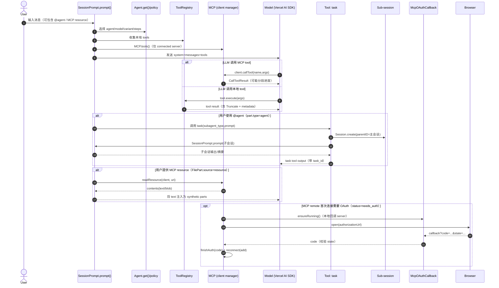

# 代理与协议（Agent & MCP）深度梳理

本章聚焦 OpenCode 的两块“可扩展能力底座”：

- **Agent（代理）系统**：把“模型/提示词/权限/最大步数”等策略封装成可切换的运行模式，并支持通过 `task` 工具启动子会话（subagent）。
- **协议（MCP: Model Context Protocol）集成**：把外部 MCP Server 暴露的 tools/resources/prompts 统一接入 OpenCode 的工具系统，并支持 OAuth 认证、动态工具刷新通知、以及资源读取。

> 主要代码分布：
> - `packages/opencode/src/agent/agent.ts`（Agent 定义、权限基线、配置合并）
> - `packages/opencode/src/session/prompt.ts`（Agent/Steps 驱动主循环、工具注入、@agent 子任务、MCP resource 特殊处理）
> - `packages/opencode/src/tool/task.ts`（`task` 工具：子代理/子会话协议）
> - `packages/opencode/src/mcp/*`（MCP client、transport、OAuth、auth storage）
> - `packages/opencode/src/server/routes/mcp.ts`、`packages/opencode/src/cli/cmd/mcp.ts`（服务端 API 与 CLI 管理面）

---

## 1. Agent：是什么、为什么、如何配置

### 1.1 Agent 的本质：一组“运行策略”

在 OpenCode 中，Agent 不是一个“独立进程”，而是一个配置对象（`Agent.Info`），核心字段包括：

- `mode`：`primary | subagent | all`（是否允许作为主代理/子代理使用）
- `permission`：权限 ruleset（来自 PermissionNext）
- `prompt`：可选系统提示词（例如 explore/summary/title 等）
- `model`/`variant`：可选模型与变体
- `steps`：可选最大步数限制（用于控制“自动连续执行”的上限）
- `options`：留给上层扩展的自由字段

这些策略在会话主循环中被读取，用来决定：

- 当前这一步用哪个模型、带哪些系统提示词
- 当前可用工具集合是什么（以及是否需要 ask 权限）
- 允许连续运行多少轮（`steps`）

### 1.2 默认 Agent 集合（build/plan/general/explore/...）

`packages/opencode/src/agent/agent.ts` 在启动时会构造一个默认 Agent 集合，然后再把用户 `opencode.json/jsonc` 中的 `agent` 配置“覆写/合并”上去：

- **build（primary）**：默认代理，执行工具，默认允许 `question/plan_enter`。
- **plan（primary）**：计划模式，显式禁止 edit 类工具，仅允许写入计划文件等受控路径。
- **general（subagent）**：通用子代理，通常用于“并行探索/多步骤任务”，并默认禁止 todo 读写。
- **explore（subagent）**：快速探索子代理，默认只允许 grep/glob/list/read/bash/webfetch/websearch 等“读/查/轻执行”。
- **compaction/title/summary（primary, hidden）**：内部用途（压缩上下文、生成标题/摘要），基本全 deny。

### 1.3 权限合并：defaults + user + agent 覆写

默认权限基线（defaults）在 `agent.ts` 中构造，然后与用户全局权限配置（`cfg.permission`）合并；每个 agent 又可以再叠加自己的权限覆写。

关键点：

- defaults 会对部分高风险能力设置 `ask/deny`（例如 `doom_loop: ask`、`question: deny` 等），再由 build/plan 显式打开。
- 对 `read` 的 `.env*` 采用 ask：允许读 `*.env.example`，对 `*.env` 与 `*.env.*` 触发确认。
- 对越界目录（`external_directory`）采用“默认 ask + 特定白名单 allow”（例如 truncation 输出目录、skills 目录等）。

### 1.4 steps：最大执行轮次限制（防“无限自动回合”）

主循环在 `packages/opencode/src/session/prompt.ts` 里，每一轮会读取当前 agent：

- `const maxSteps = agent.steps ?? Infinity`
- `const isLastStep = step >= maxSteps`

当 `isLastStep` 为 true 时，会往模型输入尾部额外塞入一个 `MAX_STEPS` 的 assistant message，提示模型“不要再继续下一步自动执行”。这是一个“软约束”，但能显著降低长链路自动循环风险。

---

## 2. 子代理与“task 协议”：如何启动 subagent

### 2.1 `task` 工具的角色

`packages/opencode/src/tool/task.ts` 定义了 `task` 工具：

- 它接收 `description/prompt/subagent_type/task_id`。
- 会创建或复用一个子会话（`Session.create({ parentID: ctx.sessionID, ... })`），把这个子会话当作“subagent 运行沙箱”。
- 子会话会带一组默认的 deny（例如禁用 todo 工具），并且**默认禁止子代理再递归调用 `task`**（除非该 agent 权限里显式包含 task 许可）。

这套机制让 OpenCode 能把“主会话”与“子任务执行”隔离开：

- 主会话只拿到子会话的摘要/输出。
- 子会话可以独立 compaction、独立多轮执行。

### 2.2 调用 `task` 前的权限门：task(permission)

`task` 工具在执行时会做权限检查：

- 需要 `permission: "task"`，并且 `patterns: [subagent_type]`。
- 如果用户在本轮显式用 `@agent` 指定子代理（见 2.3），或者是命令系统触发的 subtask（会设置 `bypassAgentCheck`），就会跳过这一步权限 ask。

### 2.3 `@agent` 语法：从“用户输入”转成 “调用 task”

`packages/opencode/src/session/prompt.ts` 在构造 user message 时对 `part.type === "agent"` 做了特殊处理：

1) 原样保留 `agent` part
2) 追加一条 synthetic text：
   - 指示模型“使用上述上下文生成 prompt 并调用 task 工具，subagent 为该 agent name”。
   - 如果该 agent 在 task 权限下会被 deny，会加一个 hint（“Invoked by user; guaranteed to exist.”），避免模型因为权限推断而拒绝。

这个设计很关键：它把“协议语义”（@agent）变成了一个更确定、更可观测的工具调用路径（task tool）。

---

## 3. MCP：连接、工具注入、资源与 OAuth

### 3.1 MCP 的定位

MCP（Model Context Protocol）在 OpenCode 里主要扮演“外部工具/资源提供者”的角色：

- tools：外部 server 定义的 tool（带 input schema）
- resources：可读资源（例如文件、知识库条目、二进制 blob）
- prompts：可复用 prompt 模板

OpenCode 通过 `packages/opencode/src/mcp/index.ts` 的 `MCP` namespace 把这些能力整合进来。

### 3.2 配置形态：local vs remote

MCP 配置来自 `Config.Info["mcp"]`：

- `type: "local"`：通过 `StdioClientTransport` 启动本地进程（`command: string[]`），用 stdio 做 MCP 传输。
- `type: "remote"`：连接远端 URL，同时尝试两种 transport：
  - `StreamableHTTPClientTransport`
  - `SSEClientTransport`

remote 默认启用 OAuth（除非显式 `oauth: false`）。

### 3.3 状态模型：connected/disabled/failed/needs_auth/needs_client_registration

`MCP.Status` 是一个 discriminated union：

- `connected`
- `disabled`
- `failed`（携带 error）
- `needs_auth`（需要 OAuth 授权）
- `needs_client_registration`（server 不支持 dynamic client registration，需要用户在配置里提供 clientId/secret）

在 remote 连接中，如果遇到 `UnauthorizedError`：

- 如果错误信息包含 registration/client_id 等线索，则标记为 `needs_client_registration` 并弹 toast。
- 否则标记为 `needs_auth`，并把对应 transport 放入 `pendingOAuthTransports`，以便后续 `finishAuth()` 使用。

### 3.4 connect/disconnect/status：连接生命周期

核心 API：

- `MCP.status()`：返回所有配置过的 MCP 的 status（包括未连接/disabled）。
- `MCP.connect(name)`：按配置创建 client；若已有 client 会先 close，避免泄露。
- `MCP.disconnect(name)`：close 并移除 client，status 置为 disabled。

内部实现使用 `Instance.state(...)` 持有 `clients/status`，并在 state 清理时统一 close。

---

## 4. MCP tools/resources/prompts：如何被“注入”进会话

### 4.1 tools：从 MCP tool → AI SDK dynamic tool

`MCP.tools()` 会遍历当前已连接的 clients：

- 只有 `status === "connected"` 的 server 才会被纳入。
- 调用 `client.listTools()` 拉取 tool 列表。
- 每个 MCP tool 会被 `convertMcpTool()` 转成 `ai` 包的 `dynamicTool()`：
  - 强制把 `inputSchema.type` 覆写为 `object`
  - `additionalProperties: false`（收紧输入）
  - execute 内部调用 `client.callTool({ name, arguments })`，并支持 timeout 与 `resetTimeoutOnProgress: true`

工具命名：

- 会把 `clientName` 与 `toolName` 做字符集清洗（只允许 `[a-zA-Z0-9_-]`，其余替换为 `_`）。
- 最终工具 ID 形如：`{client}_{tool}`。

这保证了：即使 MCP server 使用了奇怪的 tool 名称，也不会破坏 OpenCode 的工具 ID 约束。

### 4.2 resources/prompts：聚合与命名

`MCP.resources()` 与 `MCP.prompts()` 的逻辑类似：

- 对每个 connected client 分别 `listResources()` / `listPrompts()`
- 把结果聚合成一个 object
- key 形如：`{client}:{name}`（同样做字符集清洗）

额外提供：

- `MCP.getPrompt(clientName, name, args?)`
- `MCP.readResource(clientName, resourceUri)`

---

## 5. MCP OAuth：startAuth → authenticate → finishAuth

OpenCode 为 remote MCP server 实现了一套完整 OAuth 交互：

### 5.1 startAuth(mcpName)

做三件关键事情：

1) 确认是 remote 且 oauth 未禁用
2) 启动本地 callback server（`McpOAuthCallback.ensureRunning()`）
3) 生成并持久化 `state`（32 bytes 随机值，先写入 `mcp-auth.json`），再创建 `McpOAuthProvider` 与 transport

随后尝试 `client.connect(transport)`：

- 如果已经有有效 token，可能直接连接成功（返回空 authorizationUrl）。
- 如果抛 `UnauthorizedError` 且 provider 捕获了 redirect URL，则把 transport 放入 `pendingOAuthTransports`，返回 `authorizationUrl`。

### 5.2 authenticate(mcpName)

`authenticate()` 是更“用户友好”的封装：

- 调用 `startAuth()` 拿到 `authorizationUrl`。
- 如果 URL 非空：
  - 先注册 callback promise（避免 SSO 秒跳导致 race condition）
  - 再尝试打开浏览器（使用 `open` 包）
  - 若打开失败，会发布 `MCP.BrowserOpenFailed` 事件（CLI 会提示用户手动打开 URL）
  - 等待 callback 拿到 `code`
  - 校验 state（不匹配直接报错并清理 state，防 CSRF）
  - 调用 `finishAuth(mcpName, code)`

### 5.3 finishAuth(mcpName, code)

- 从 `pendingOAuthTransports` 取出 transport（没有则说明不是一个“正在进行的 auth flow”）
- `transport.finishAuth(code)` 完成 token exchange
- 清理 code verifier
- 重新走 `MCP.add(name, config)` 建立连接

### 5.4 token 存储安全性

OAuth 凭证存储在 `mcp-auth.json`（见 `packages/opencode/src/mcp/auth.ts`）：

- 文件权限被设置为 `0600`（尽量限制本机泄露面）
- entry 与 `serverUrl` 绑定：如果同名 server 的 URL 发生变化，会使旧凭证失效，避免“换了 URL 仍沿用旧 token”

---

## 6. MCP 在 Session 里的“落点”：工具与资源如何进模型输入

### 6.1 工具注入：`resolveTools()` 合并 ToolRegistry + MCP.tools()

在 `packages/opencode/src/session/prompt.ts` 的 `resolveTools()` 中：

- 先从 `ToolRegistry.tools(...)` 拿到内置/插件/工作区工具
- 再额外合并 `await MCP.tools()` 返回的动态工具（这也是 MCP 能被模型直接 tool-call 的关键）

工具执行时的 `Tool.Context` 会包含：

- `ctx.ask()`：走 `PermissionNext.ask(...)`，ruleset 会合并 agent.permission 与 session.permission
- `ctx.metadata()`：让工具运行过程可在 UI/parts 状态里呈现

### 6.2 MCP resource：作为 FilePart 的特殊 source

`createUserMessage()` 会优先检查 `part.type === "file"` 且 `part.source?.type === "resource"`：

- 先插入 synthetic text：`Reading MCP resource: ...`
- `await MCP.readResource(clientName, uri)` 拉取内容
- 把 text 内容作为 synthetic text part 注入（blob 则目前只注入占位提示）
- 最后把原始 file part 也附带回 message（保留 UI/附件语义）

这保证了 MCP 资源既能在会话中“可见”，也能被模型直接读到（text 内容）。

---

## 7. 管理面：Server Routes 与 CLI

### 7.1 HTTP API（Hono）

`packages/opencode/src/server/routes/mcp.ts` 提供：

- `GET /mcp`：status
- `POST /mcp`：add
- `POST /mcp/:name/auth`：startAuth（只返回 authorizationUrl）
- `POST /mcp/:name/auth/callback`：finishAuth（传 code）
- `POST /mcp/:name/auth/authenticate`：authenticate（会尝试打开浏览器并等待 callback）
- `DELETE /mcp/:name/auth`：removeAuth
- `POST /mcp/:name/connect`：connect
- `POST /mcp/:name/disconnect`：disconnect

### 7.2 CLI（opencode mcp ...）

`packages/opencode/src/cli/cmd/mcp.ts` 提供：

- `opencode mcp list`：显示 server 状态、类型、OAuth token 状态
- `opencode mcp auth`：交互式选择 server 并走 `MCP.authenticate()`
  - 若无法自动打开浏览器，会通过 `MCP.BrowserOpenFailed` 提示手动打开 URL
- `opencode mcp logout`：清理本地 OAuth 凭证
- `opencode mcp add`：把 MCP server 写入配置文件（jsonc-parser 保留注释）

---

## 附：LSP 集成（语义定位与诊断闭环）

LSP（Language Server Protocol）是“编辑器/工具 ↔ 语言智能服务（language server）”之间的标准协议，用来提供：跳转定义、找引用、hover 类型信息、符号索引、诊断（语法/类型错误）等能力。

在 OpenCode 的 **Agent & 工具系统**里，LSP 的作用主要有两类：

1) **语义级定位**（比 grep 更准）
- 通过内置 `lsp` 工具提供 `goToDefinition/findReferences/hover/documentSymbol/workspaceSymbol/...`
- 典型场景：追调用链、评估改动影响面、跨文件跳转定位实现
- 代码：`packages/opencode/src/tool/lsp.ts`

2) **改代码后的诊断闭环**（让 Agent 自己把错误修到过关）
- `edit/write/apply_patch` 等改文件工具在落盘后会 `LSP.touchFile(...)` + `LSP.diagnostics()`
- 如果检测到 severity=error，会把摘要以 `<diagnostics ...>` 形式拼进 tool output，驱动模型继续修复
- 代码：`packages/opencode/src/tool/edit.ts`、`packages/opencode/src/tool/write.ts`、`packages/opencode/src/tool/apply_patch.ts`

初始化与可观测性：
- 实例启动会 `await LSP.init()`：`packages/opencode/src/project/bootstrap.ts`
- Server 暴露 `GET /lsp` 状态：`packages/opencode/src/server/server.ts`（SDK 侧生成 `client.lsp.status()`）

### Agent 什么时候用 LSP vs grep/read？（简版决策）

- **不知道入口在哪**：先用 `glob/list` 找范围，再用 `grep` 找字符串/事件名/路由
- **需要“原文证据”**：用 `read` 精确读文件片段（准备 patch/解释逻辑时必需）
- **需要“符号关系”**：用 `lsp`（定义/引用/hover/符号），避免同名字符串/注释噪音

## 8. 总结：一条端到端链路

把 Agent 与 MCP 放在一起看，核心是一条“会话驱动 → 工具注入 → 工具执行/资源读取”的链路：

1) `SessionPrompt.prompt()` 进入主循环，确定本轮 `agent/model/variant/steps`
2) `resolveTools()` 聚合本地工具 + MCP 动态工具
3) 模型产生 tool-call（可能是 MCP tool）→ `dynamicTool.execute()` → `client.callTool(...)`
4) 如果用户提供了 MCP resource（FilePart.source=resource）→ `MCP.readResource()` 把内容注入消息 parts
5) 若用户用 `@explore` 等指定子代理 → 转为 `task` 工具 → 子会话运行并回传摘要

这使 OpenCode 的扩展面非常清晰：

- “策略”用 Agent 表达（权限/模型/步数/提示词）
- “能力”用 tools/resources/prompts 表达（其中 MCP 是外部能力的一等接入方式）

---

## 9. 附录：端到端时序图（Mermaid）

下面这张图把三条常见路径放在同一张时序图里：

- 主会话的常规一轮（resolve tools → LLM tool-call → 执行）
- 用户通过 `@agent` 触发 `task` 工具创建子会话
- MCP remote 需要 OAuth 时的认证分支、以及 MCP resource 的读取分支

